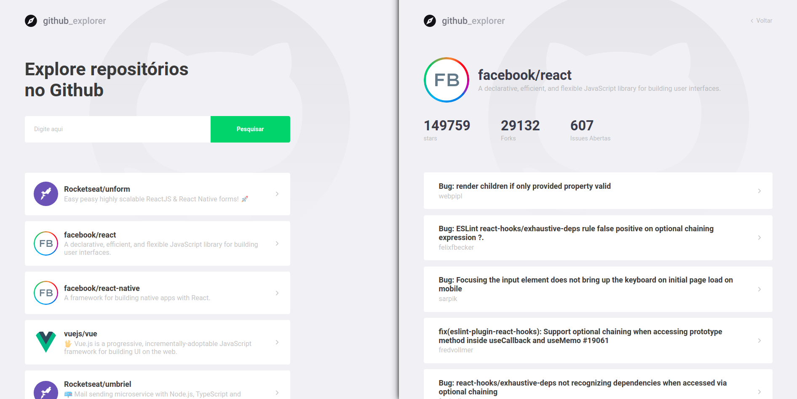

# Primeiro projeto com ReactJS

This step we gonna start our learning of ReactJS, creating the first project using Type. This point the developer must know concepts of components, states, and properties, but them gonna be remembered during the classes.

## Project overview

## How to run

1. `git clone` this repository
2. Make sure you have `yarn` installed
3. Inside project folder run the command `$ yarn` to download dependencies
4. Run project using the command `$ yarn start`

## keep coding!
